# Melotopia For HarmonyOS - 鸿蒙原生音乐播放器

---

## 公告 - 谨防上当受骗！

**本应用不存在任何收费行为！目前已发现有人在其他平台上售卖此软件，这些都是非授权的行为，谨防上当受骗！**

应用官方发布渠道请认准：
- GitHub仓库
- AppGallery应用尝鲜邀请测试
- 测试QQ群 1019225012

## 关于仓库暂停提交代码说明

尊敬的社区成员及用户：

很遗憾地通知大家，由于近期发生的一系列违反开源协议与精神的事件，我们不得不做出该决定：
即日起，Melotopia-HMOS 项目转为闭源，不再以 GPL 2.0 协议提供源代码。

Melotopia自开源以来，始终秉承 GPL 2.0 协议的精神，致力于通过开放协作推动技术共享。然而，我们发现有第三方在未遵守协议要求的情况下：
- 恶意搬运仓库，未注明项目来源及原作者；
- 二次修改后闭源分发，更公然宣称该应用为其个人原创作品，完全抹杀原开发者的贡献；
- 完全无视开源社区的基本尊重原则，未与原作者进行任何沟通。

此类行为严重侵犯了协议赋予的权利，为保护项目成果及原作者权益，我们决定：
- 现有仓库（包括 v1.5.5 及之前版本）保持公开，但将不再推送新的开源代码；
- 未来的开发可能会以其他形式继续，但不再以 GPL 协议开源；
- 我们仍欢迎真正尊重开源精神的开发者参与讨论，但不会容忍恶意搬运和篡改行为。

我们深知此举可能影响部分用户的信任，但开源生态的健康发展需建立在相互尊重的基础上。
我们仍会继续维护Melotopia项目，感谢各位用户一直以来的支持！

<p align="right">Chenlvin 2025/5/29</p>

---

## 📖 项目概述

简洁实用的音乐播放器

【本地曲库】
一键扫描并导入本地音乐文件，支持多种音频格式，随时随地畅听。

【在线播放】
支持 API 连接至在线平台，获取云端歌曲。

【界面设计】
简洁流畅，操作直观。支持自定义背景与主题色，打造用户个性化风格。

【多端适配】
支持直屏、平板、折叠屏及 PC 设备，在各种终端上都能获得流畅的播放体验。

---

## 🛠️ 技术栈
|  类别   |            技术实现            |  
|:-----:|:--------------------------:|  
| 开发语言  |           ArkTS            |  
| API版本 |        OHOS API 17         |  
| 系统要求  | HarmonyOS NEXT 5.0.1.120+  |  

---

## 📦 安装方式

### 1.源码编译

```bash
git clone https://github.com/Chenlvin/Melotopia-HMOS
`````

### 2.签名安装Hap包

[GitHub Releases](https://github.com/Chenlvin/Melotopia-HMOS/releases)

---

## 🎵 本地播放

由于鸿蒙系统限制，应用无法实现全局扫描，只能扫描下载目录中的文件。

### **导入本地歌曲步骤：**

1.打开系统文件管理器，将本地音频文件、封面图、歌词文件放入“我的手机/Download/Melotopia”根目录

2.在应用首页点击底部“本地”切换至本地Tab页

3.点击本地Tab页右上方的“文件”图标，选择“导入本地歌曲”

4.应用会自动扫描Download目录下的音频、封面、歌词

5.扫描完毕后点击右上方“导入”按钮即可导入歌曲

#### 说明：

- 目前仅支持扫描根目录，暂不支持扫描子文件夹
- 音频文件支持格式：.mp3 .flac .wav .aac .ogg (更多格式尚未测试: .m4a)
- 封面图片支持格式：.jpg .png
- 歌词文件支持格式：.lrc (暂不支持逐字歌词, 本地歌词暂不支持多语言)

---

## ☁️ 云端支持

可在应用“我的”—“应用设置”—“云端配置”中填入API接口地址以接入在线平台

本应用支持以下API：

- [NeteaseCloudMusicApi](https://www.npmjs.com/package/NeteaseCloudMusicApi)
- [NeteaseCloudMusicApi Enhanced](https://github.com/NeteaseCloudMusicApiEnhanced/api-enhanced)

_ⓘ 本软件仅供学习与技术研究使用，所有音乐内容均通过官方途径获取。仅支持在用户已有合法权限下的播放与下载，严禁用于商业用途或非法传播。请遵守相关法律法规与平台协议。_

---

## 🚗 关于 HiCar

由于白名单限制, 需要签名安装带"HiCar"字样的Hap包

此Hap包与主线版本包名不同, 可以共存

安装HiCar版本后, 需要在车机应用市场尝鲜区添加“咪咕音乐”后才能使用

---

## ⚠️ 免责声明

> ❗ **重要提示**：
> 1. 本应用为**纯界面实现层**，不内置/分发任何音源内容
> 2. 云端功能并非应用自带，需由用户**自行搭建合规服务**，由此产生的版权问题与开发者无关
> 3. 禁止将本项目用于二次分发受版权保护的内容

---

## 📧 联系方式

**Email:** chenlvin126@outlook.com

**QQ交流群:** 1019225012

---

## ✨ 参与贡献

- [@Chenlvin](https://github.com/Chenlvin)
- [@alexzhengzzz NERV](https://github.com/alexzhengzzz)
- [@lsbnbdz ShiChao](https://github.com/lsbnbdz)

---

## 📱 界面预览
### Phone - 手机设备
|            **发现**            |           **音乐云盘**            |            **播放器**            |
|:----------------------------:|:-----------------------------:|:-----------------------------:|
| 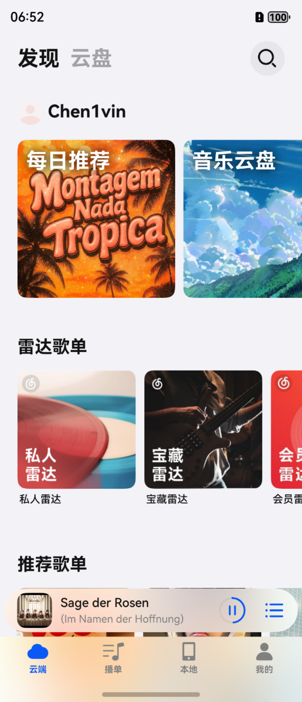 | 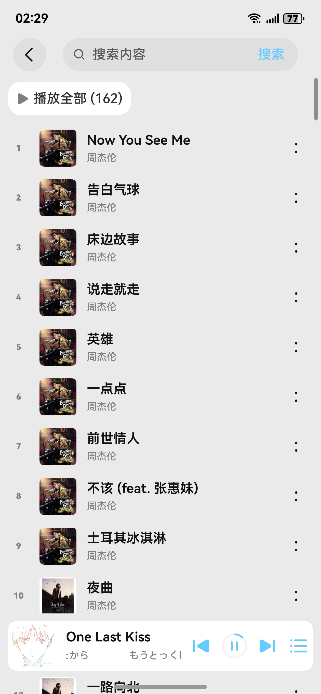 | 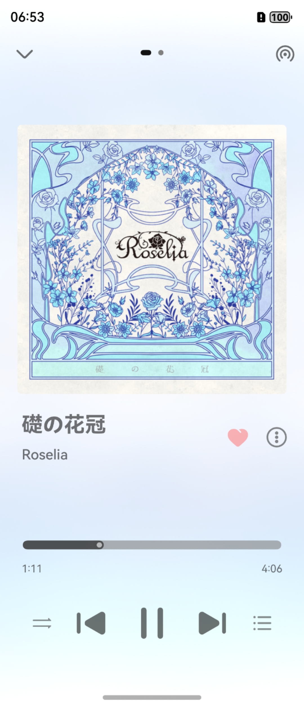 |
|          **播放页功能**           |           **歌词界面**            |           **播放列表**            |
| 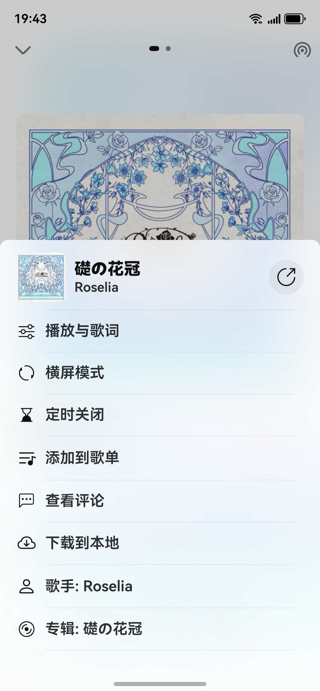 | 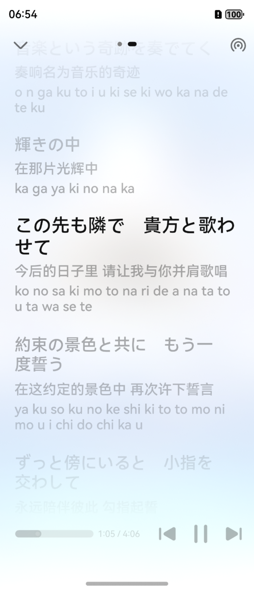  | 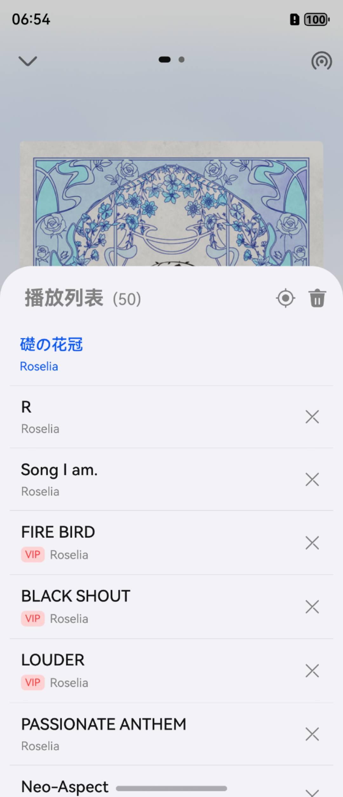  | 

|          **横屏播放器**           |
|:----------------------------:|
| 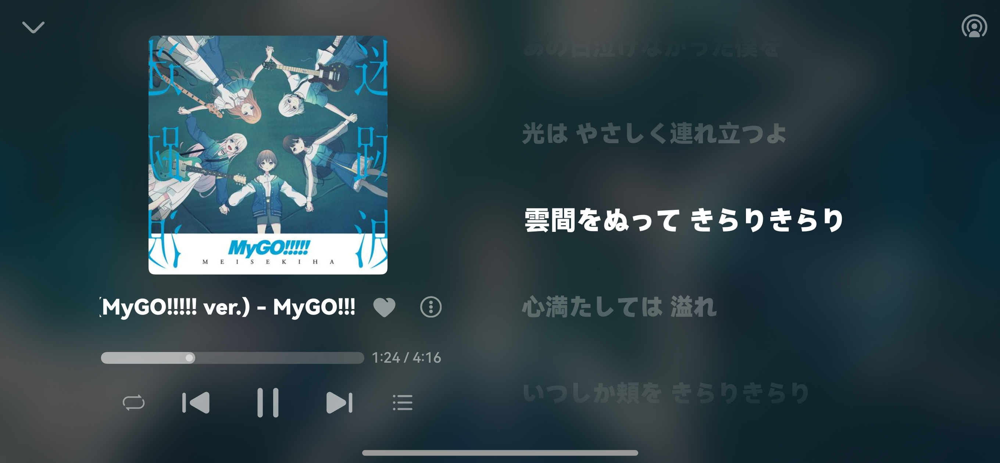 |

### Tablet - 平板设备
|         **播控/歌词界面**          |           **二级页面**           |
|:----------------------------:|:----------------------------:|
| 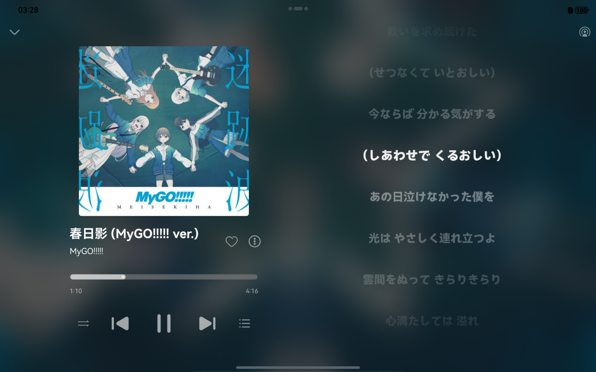 | 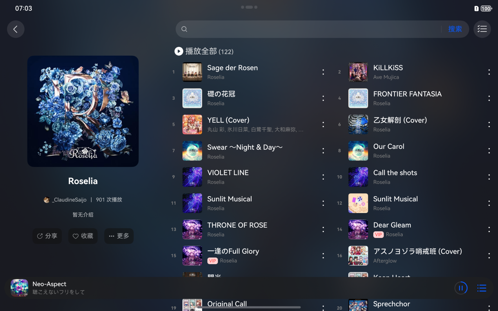 |

### Foldable - 折叠设备
|           **歌单页**            |         **播控/歌词界面**          |
|:----------------------------:|:----------------------------:|
| 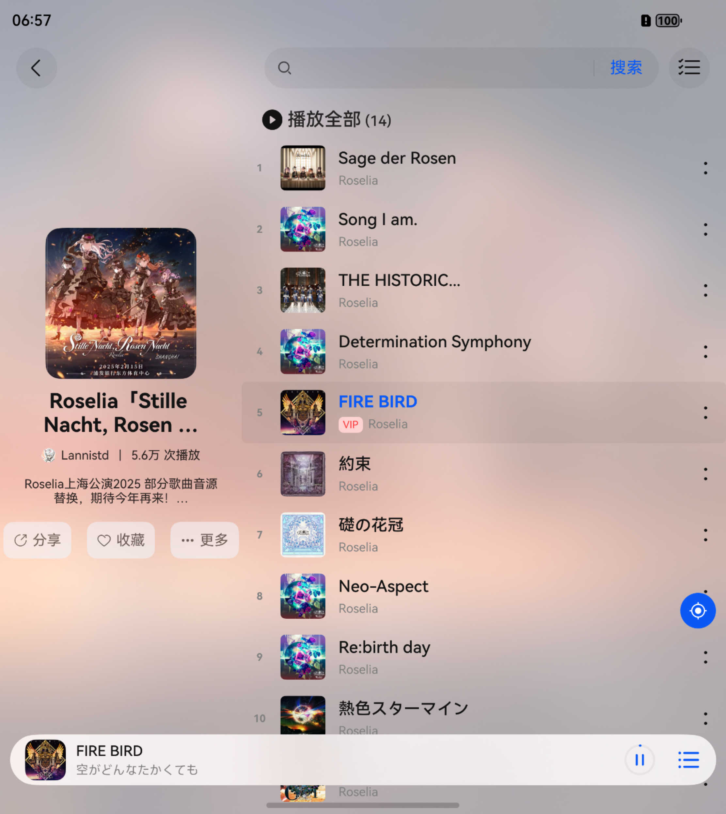 | 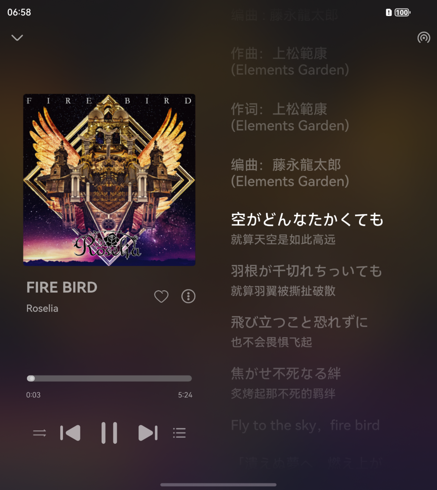 |
|        **Pura X 外屏**         |        **Pura X 外屏**         |
|  |  |

### PC/2in1 设备
|           **发现页**            |           **歌词界面**           |
|:----------------------------:|:----------------------------:|
| 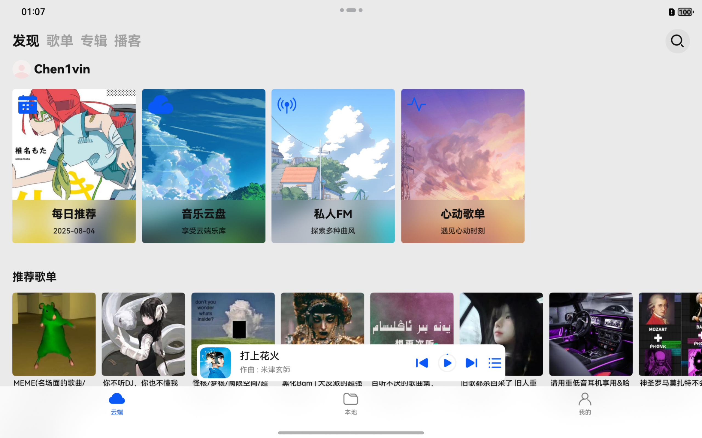 | 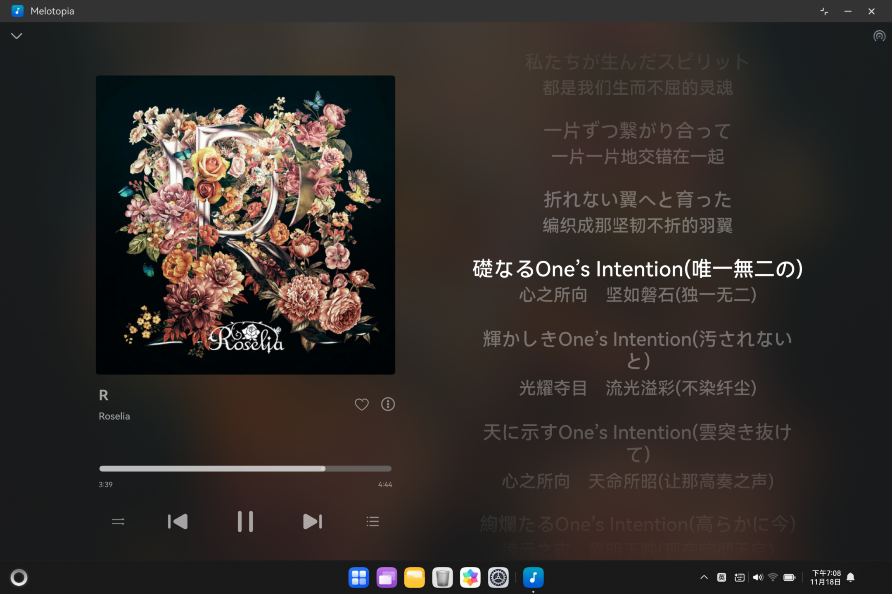 |
